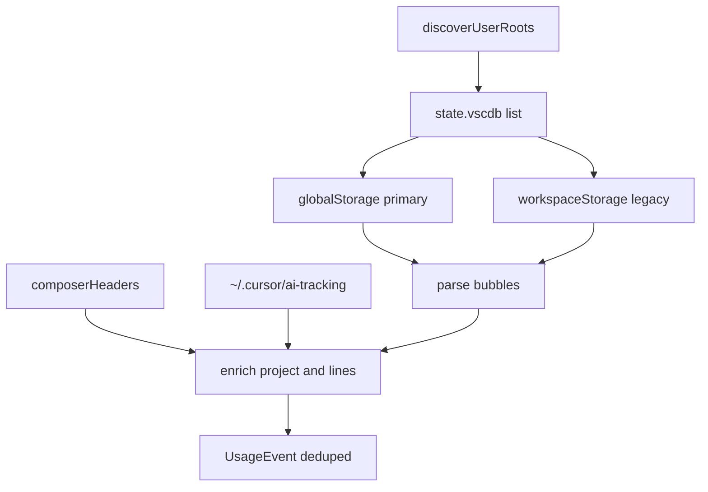

# 完善 Cursor 本地采集（多安装形态）

## 现状问题

[`packages/providers/src/local/cursor.ts`](packages/providers/src/local/cursor.ts) 目前只扫：

`%APPDATA%/Cursor/User/workspaceStorage/*/state.vscdb`

本机实测：

- `workspaceStorage` 下全部 `cursorDiskKV` 为空（0/21）
- 真实数据在 `User/globalStorage/state.vscdb`（约 489 个 composer、7.8 万 bubble）
- bubble 的 `tokenCount` 常为 `{0,0}`，需字符估算；模型常缺省，需从别处补

因此现有连接器在新版 Cursor 上几乎采不到事件。

## 目标架构

## 1. 多安装根目录发现

在 `cursor.ts` 内实现 `discoverUserRoots()`，按顺序收集存在的 `.../User` 目录（去重 realpath）：

1. `CURSOR_USER_DATA_DIR`（已有，可为 `User` 或其父级 user-data-dir）
2. `VSCODE_PORTABLE` / `CURSOR_PORTABLE` 下的 `user-data/User`（若存在）
3. 各平台默认产品目录：
   - Windows: `%APPDATA%/{Cursor,Cursor Nightly}/User`
   - macOS: `~/Library/Application Support/{Cursor,Cursor Nightly}/User`
   - Linux: `~/.config/{Cursor,Cursor Nightly}/User`
4. Agent 家目录：`CURSOR_AGENT_HOME` 或 `~/.cursor`（仅用于 ai-tracking，不当作 state.vscdb 根）

每个 root 同时检查：

- `globalStorage/state.vscdb`（主源）
- `workspaceStorage/*/state.vscdb`（旧版/残留）

## 2. 解析与合并策略（单一连接器内完成）

仍保留一个 connector：`cursor-local`，避免看板出现重复 provider。

对每个 `state.vscdb`：

- 只读打开（优先 `DatabaseSync(path, { readOnly: true })`；失败再跳过，不阻塞其它库）
- `value` 兼容 `string | Uint8Array`（本机 agentKv 已出现 Buffer）
- 解析 `composerData:*` + `bubbleId:*:*`，逻辑沿用现有 `toEvent`（真实 token 优先，否则 4 字符/token 估算输出）
- 若存在 `composerHeaders` 表：用其 `workspaceIdentifier.uri` / `trackedGitRepos` 填 `extra.project`，并带上 `linesAdded` / `linesRemoved`（会话级汇总只挂在该会话首次 assistant 事件或单独记在 extra，避免按 bubble 重复累加行数——**行数只写入每个 composer 的一条汇总事件或仅放 extra 不进 DailyRow 累加**；更稳妥：bubble 事件不写 lines，另从 headers 按会话产出 0 token、带 lines 的 1 条事件会导致请求虚增。采用：**lines 只进 bubble 事件的 extra，不映射到 UsageEvent.linesAdded**，除非后续单独做会话级事件。MVP 保持 bubble 级请求统计正确。）

去重键：`bubbleId`（`extra.bubbleId`）或 `composerId:bubbleId`；跨 global/workspace 同 bubble 只保留一条（优先有真实 token / 有文本的那条）。

## 3. 模型补全（ai-tracking）

读取 `~/.cursor/ai-tracking/ai-code-tracking.db` 的 `ai_code_hashes`：

- 按 `conversationId`（= composerId）聚合 `model`（取出现次数最多的非 null/非 default）
- 仅当 bubble/composer 模型无效（`default` / `?` / 缺失）时回填

不把每个 code hash 当成一次 API 请求（会严重高估）。

## 4. Fixture 与文档

- 更新 [`scripts/make-cursor-fixture.mjs`](scripts/make-cursor-fixture.mjs)：在 fixture 中增加 `User/globalStorage/state.vscdb`（主）+ 保留 workspace 样例；可选最小 `ai-tracking` 库用于模型回填
- 更新 [`README.md`](README.md) 数据源表：说明支持标准 / Nightly / `CURSOR_USER_DATA_DIR` 便携，主路径为 globalStorage
- 更新 connector `describe()` 文案

## 5. 明确不做（本轮）

- 逆向 Cursor 云端用量 API
- 完整解析 `agentKv` protobuf / `~/.cursor/chats/**/store.db`
- 把 ai-tracking 每条 snippet 计为 requests

## 关键改动文件

- [`packages/providers/src/local/cursor.ts`](packages/providers/src/local/cursor.ts) — 发现、global/workspace 双读、去重、模型回填
- [`scripts/make-cursor-fixture.mjs`](scripts/make-cursor-fixture.mjs) — fixture 对齐新布局
- [`README.md`](README.md) — 数据源说明
- 必要时轻改 [`docs/PROVIDERS.md`](docs/PROVIDERS.md) 一句路径说明

## 验收

- 对本机默认安装跑 `pnpm collect`，Cursor 事件数应显著大于 0（不再依赖空的 workspaceStorage）
- `CURSOR_USER_DATA_DIR` 指向 fixture 时能采到真实 token + 估算两条路径
- 同一 bubble 不会因 global+workspace 双读重复入库（依赖 store 的幂等或采集侧去重）
